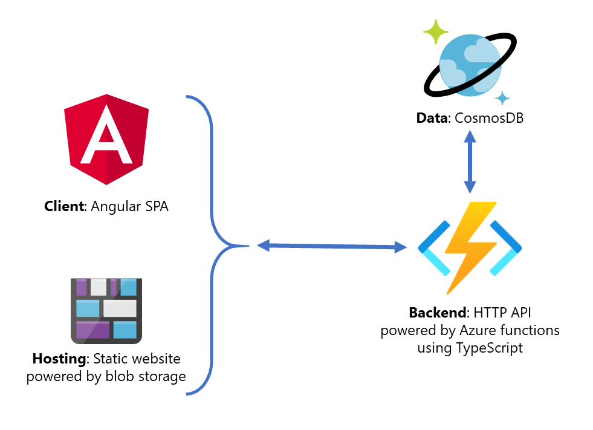

# Microsoft Learn Live

Microsoft Learn Live is a series of instructor led courses designed to increase our learners' knowledge of Azure technologies.
As an extension of Microsoft Learn, Learn Live helps learners to connect multiple concepts to complete a real-world project.
Where a typical Learn module focuses on one specific job task, e.g. migrate your SQL database to Azure SQL, a Learn Live series will connect multiple job tasks to complete a full solution, e.g. migrate and secure a web based application to the cloud which includes migration of the database and the existing data.

[Find out more about Learn Live](https://aka.ms/learn-live)

## About this repository

This repository contains the sample code for our Learn Live series called "Foundations of Serverless Computing for Developers: Build a HTTP API using Azure Functions".

For details, we invite you to check out [Learn Live](https://aka.ms/learn-live) and the [instructions and notes about the exercises included in the series](https://aka.ms/learn-live-foundations-serverless-dev-module).

Also, make sure to read the paragraph ["Series overview"](#series-overview) here in the README.

The repo contains:

- A backend HTTP API using Azure functions (implemented with TypeScript). The API offers endpoints to get and modify product data which is stored in a CosmosDB instance.
- The Angular client which we provide as a frontend to show how the API could be used.



The focus of the Learn Live series is on Azure functions. The client implementation exists for reference but is not discussed in detail. The same is true for the CosmosDB instance.

## Build status

The code in this repo is using GitHub Actions to build and publish the backend API and the Angular client projects to Azure.

|GitHub Actions Workflow  |Status  |
|---------|---------|
|Build and deploy Azure Functions API     |         |
|Angular client     |         |

A **deployed version of the client** can be found here (Note that this version is **readonly** - you cannot create or modify products!):

https://aka.ms/learn-live-foundations-serverless-dev-demo

Give it some time to warm up when switching to the products page.

## Building the projects

Note that an Azure CosmosDB instance is required to successfully use the solution. Details about the setup process are available in our [workshop module](https://aka.ms/learn-live-foundations-serverless-dev-module).

### Client

The client is an Angular SPA app. Find it under [src/app](src/app).

If you're unfamiliar with Angular, you can find information how to deploy and run the client app by inspecting the [documentation](https://angular.io/start/start-deployment#building-locally).

With all the tooling installed you can use the following command to test the client app locally and start serving the wesbite:

`ng serve`

Then navigate to `http://localhost:4200/`.

### Backend/API

The HTTP API at [src/api](src/api) is powered by Azure functions. We recommend to run the functions project locally using Visual Studio Code and the [Azure functions core tools](https://docs.microsoft.com/azure/azure-functions/functions-run-local).

For developing locally, add `local.setting.json` file that stores your configuration settings. For example:

```json
{
  "IsEncrypted": false,
  "Values": {
    "AzureWebJobsStorage": "",
    "FUNCTIONS_WORKER_RUNTIME": "node",
    "CONNECTION_STRING": "AccountEndpoint=...",
    "COSMOS_DB_NAME": "maindb",
    "COSMOS_DB_CONTAINER": "data"
  },
  "Host": {
    "CORS": "*"
  }
}
```

The products stored in the CosmosDB container must use the following format:

```json
{
    "id": "p001",
    "itemType": "product",
    "name": "Pre-sharpened Wood Cased Pencils",
    "description": "Rounded hexagonal shape with satin-smooth finish for a secure, comfortable grip",
    "price": 499,
    "category": "Writing",
    "stockUnits": 100,
    "thumbnailImage": "p001.png"
}
```

You can find sample data in the [sample data](/scripts/sampledata) folder of this repo.
Note that the container must use a **partition key** of `/itemType`.

## Series overview

It's time to go back to school and you're working on a solution for a school supplies retailer.
In the past, they had users complain about slow website response times during the back-to-school time. 
This year, the shop wants to be prepared. 
Customers should enjoy a highly responsive shopping experience when millions of kids head back to school and buy pencils, glue, rulers, markers, and many other supplies.
The development team decides to overhaul the website and re-implement inventory management using Azure technology.
Instead of the monolithic solution that tightly couples the customer-facing user interface and the inventory system,
they now plan a decoupled system, where the shopping website communicates with the inventory system over 
an HTTP API.
They have already finished work on the new website. 
Also, a cloud-based Cosmos DB storage solution with some test data is set up and configured.
The part still missing is the new inventory system, which must be able to handle the spikes in seasonal
demand without performance degradation. 
Demand is lower during the remainder of the year, so the retailer doesn't want to pay for unused 
infrastructure and is looking for a cost-efficient solution that can scale dynamically 
while keeping maintenance requirements to a minimum.
You want to identify the Azure services relevant for the project and get hands-on experience with them, 
so you can successfully implement the optimal HTTP API.

## Contributing

This project welcomes contributions and suggestions.  Most contributions require you to agree to a
Contributor License Agreement (CLA) declaring that you have the right to, and actually do, grant us
the rights to use your contribution. For details, visit https://cla.opensource.microsoft.com.

When you submit a pull request, a CLA bot will automatically determine whether you need to provide
a CLA and decorate the PR appropriately (e.g., status check, comment). Simply follow the instructions
provided by the bot. You will only need to do this once across all repos using our CLA.

This project has adopted the [Microsoft Open Source Code of Conduct](https://opensource.microsoft.com/codeofconduct/).
For more information see the [Code of Conduct FAQ](https://opensource.microsoft.com/codeofconduct/faq/) or
contact [opencode@microsoft.com](mailto:opencode@microsoft.com) with any additional questions or comments.
